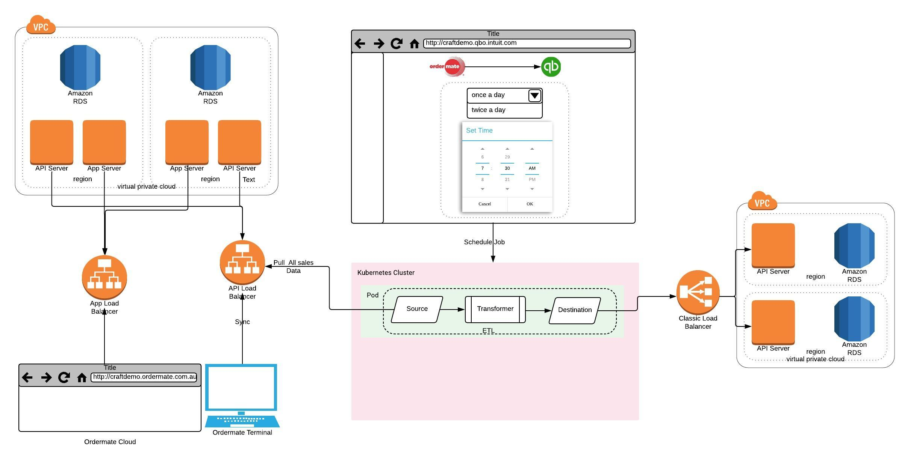

# [Craft-Demo]() Craft Demo

Sample implementation for integration of ordermate with quickbooks online

## TL;DR
```
$ node dist/index.js InvoicesSync
$ node dist/index.js ExpensesSync
$ node dist/index.js ProductsSync
$ node dist/index.js PaymentsSync
```

## Deployment requirements

- Language: typescript
- requires: NODEJS ^v.7.9.0
- AWS keys in .aws/credetials OR environment variables

### ENVIRONMENT VARIABLES
```
NODE_ENV=production
```

### Changes in config/production.yml
```
- ExpensesSync ETL
```

## Tables for storing etl savepoints
```
CREATE TABLE `etls_savepoint` (
  `id` int(5) unsigned NOT NULL AUTO_INCREMENT,
  `etl_name` varchar(255) NOT NULL,
  `savepoint` varchar(1000) NOT NULL DEFAULT '',
  `finished_date` datetime NOT NULL ON UPDATE CURRENT_TIMESTAMP,
  PRIMARY KEY (`id`),
  UNIQUE KEY `etl_name` (`etl_name`),
  KEY `finished_date` (`finished_date`)
) ENGINE=MyISAM AUTO_INCREMENT=4 DEFAULT CHARSET=utf8;
```

## Architecture



