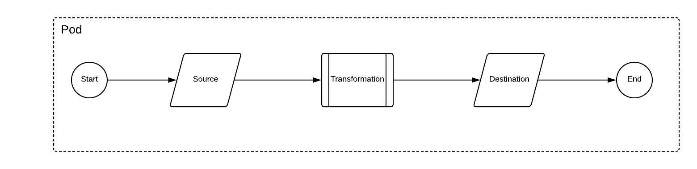

# [Craft-Demo]()

Sample implementation for integration of ordermate with quickbooks online

## Install
```
yarn install
```

## TL;DR
```
$ node dist/index.js SalesSync
$ node dist/index.js InvoicesSync
```

## run yarn way
```
yarn run etl SalesSync
```

## Deployment requirements

- Language: typescript

- requires: NODEJS ^v.7.9.0

  

### ENVIRONMENT VARIABLES
```
NODE_ENV=production
```

### Changes in config/production.yml
```
- SalesSync ETL
```

## Tables for storing etl savepoints
```
CREATE TABLE `etls_savepoint` (
  `id` int(5) unsigned NOT NULL AUTO_INCREMENT,
  `etl_name` varchar(255) NOT NULL,
  `savepoint` varchar(1000) NOT NULL DEFAULT '',
  `finished_date` datetime NOT NULL ON UPDATE CURRENT_TIMESTAMP,
  PRIMARY KEY (`id`),
  UNIQUE KEY `etl_name` (`etl_name`),
  KEY `finished_date` (`finished_date`)
) ENGINE=MyISAM AUTO_INCREMENT=4 DEFAULT CHARSET=utf8;
```

## Architecture


## Current Flow


Current implementation is an ETL process where:

- **Source:** is responsible for fetching data from the vendor API. (currently implemented using CSV file)

- **Transformation:** is responsible for transforming vendor data into qbo compatible format.
- **Destination:** is responsible for pushing data into Quickbooks online

